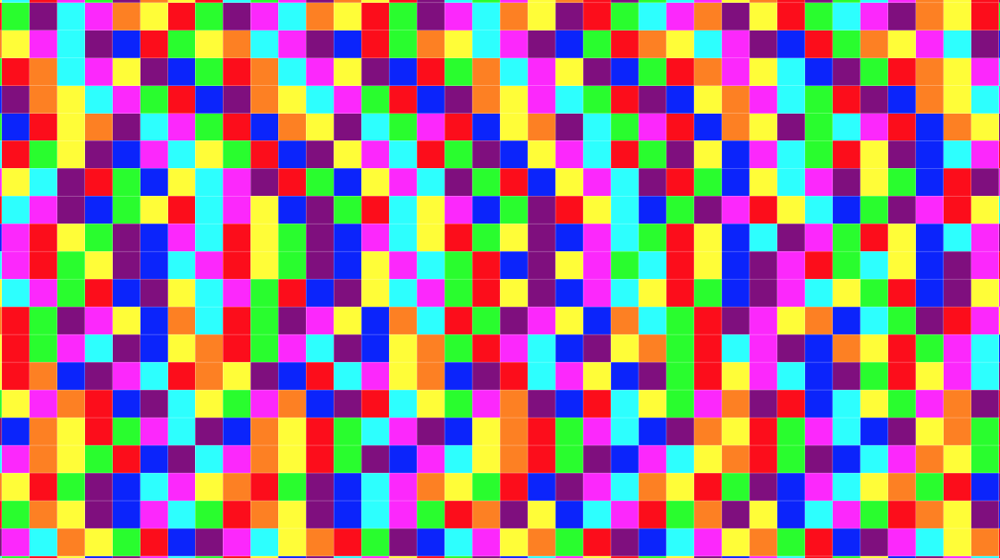

# raytracer

The codebase requires OpenGL, GLUT and CMake.
You can also clone the repo with --recursive to get submodules.

## External Libraries/Utilities
- [cyCodeBase](https://github.com/cemyuksel/cyCodeBase/tree/5b909ced22ea2d106e8d4ecc6a1ab90ab29b7c8c)
- [LodePNG](https://github.com/lvandeve/lodepng/tree/3d639635bb1b00ef21d11ce478373991c3eca1d5)
- [TinyXML](https://github.com/leethomason/tinyxml2/tree/ff61650517cc32d524689366f977716e73d4f924)

## Current Progress
A visualization of multithread pixel rendering (8-core concurrency):

